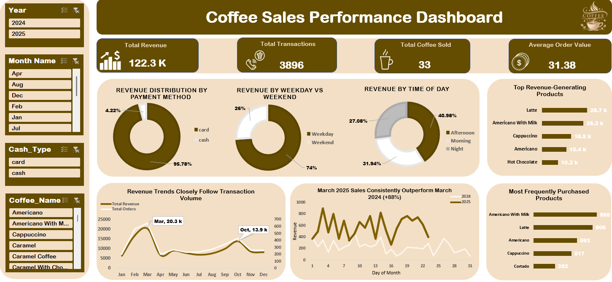

# ☕ Coffee Sales Analysis | Excel Dashboard

## 📌 Project Overview

This project analyzes historical coffee sales transaction data from 2024 and 2025 to evaluate business performance, identify sales patterns, understand customer purchasing behavior, and highlight opportunities for improving revenue performance.

The project was developed entirely using Microsoft Excel, including data preparation, calculated fields, Pivot Tables, Pivot Charts, and an interactive dashboard.

---

## 🎯 Business Objective

The goal of this analysis is to answer key business questions such as:

- How is revenue performing over time?
- Which coffee products generate the most revenue?
- Which products are purchased most frequently?
- When are the busiest sales periods?
- How does customer behavior differ between weekdays and weekends?
- What payment methods do customers prefer?
- How did sales performance change between 2024 and 2025?

---

## 🛠 Tools Used

- Microsoft Excel
- Pivot Tables
- Pivot Charts
- Excel Functions
- Data Cleaning
- Data Transformation
- Slicers
- Interactive Dashboard
- Time-Series Analysis

---

## 📂 Dataset

The analysis uses coffee vending-machine transaction data covering 2024 and 2025.

Key fields include:

- Date
- Time
- Payment Method
- Transaction Value
- Coffee Product

Additional analytical fields were created to support the analysis, including:

- Transaction ID
- Hour
- Time of Day
- Calendar attributes

---

## 🧹 Data Preparation

The raw datasets were prepared and transformed in Excel before analysis.

The workflow included:

1. Combining the 2024 and 2025 datasets
2. Standardizing column names and formats
3. Formatting date and time fields
4. Creating unique transaction IDs
5. Creating hour-based fields
6. Categorizing transactions by time of day
7. Building a calendar table
8. Preparing the final dataset for Pivot Table analysis

---

## 📊 Analysis Performed

The project focuses on four main analytical areas:

### 1. Sales Performance

- Total Revenue
- Total Transactions
- Average Order Value
- Monthly Revenue Trends

### 2. Product Performance

- Top Revenue-Generating Products
- Most Frequently Purchased Products
- Product Revenue Contribution
- Product Portfolio Performance

### 3. Customer Purchasing Behavior

- Payment Method Preferences
- Weekday vs Weekend Performance
- Sales by Time of Day
- Peak Purchase Periods

### 4. Year-over-Year Analysis

- 2024 vs 2025 Revenue
- Transaction Performance
- Product Popularity Changes
- Sales Trend Comparison

---

## 📊 Dashboard Preview

The interactive Excel dashboard allows users to filter performance by:

- Year
- Month
- Payment Method
- Coffee Product

The dashboard presents:

- Total Revenue
- Total Transactions
- Average Order Value
- Product Variety
- Payment Method Distribution
- Weekday vs Weekend Revenue
- Revenue by Time of Day
- Monthly Revenue Trends
- Year-over-Year Sales Comparison
- Top Revenue-Generating Products
- Most Frequently Purchased Products

---

## 🔎 Key Insights

### Revenue Growth

Total revenue reached approximately **$122.3K** across **3,896 transactions**.

March 2025 significantly outperformed March 2024, recording approximately **88% year-over-year revenue growth**.

### Product Performance

Revenue is concentrated among a small group of core products.

The strongest revenue contributors include:

- Latte
- Americano with Milk
- Cappuccino
- Americano
- Hot Chocolate

Latte generated the highest individual product revenue.

### Payment Behavior

Card transactions dominate customer payments, contributing approximately **96%** of sales, while cash represents only a small share.

### Weekday vs Weekend

Approximately:

- **74% of revenue comes from weekdays**
- **26% comes from weekends**

This indicates substantially stronger demand during working days.

### Time of Day

Afternoon sales generate the largest share of revenue, followed by morning and night periods.

### Revenue and Transaction Relationship

Revenue trends closely follow transaction volume, indicating that changes in sales performance are primarily driven by changes in customer purchasing activity.

---

## 💡 Business Recommendations

Based on the analysis:

- Prioritize high-performing products such as Latte and Americano variants in promotions and bundles.
- Investigate low-performing products before expanding the portfolio further.
- Align staffing and promotions with peak sales periods.
- Develop targeted weekend promotions to improve underperforming weekend demand.
- Leverage the strong adoption of card payments through cashless loyalty initiatives.
- Continuously monitor newly introduced products to identify those with scaling potential.

---
